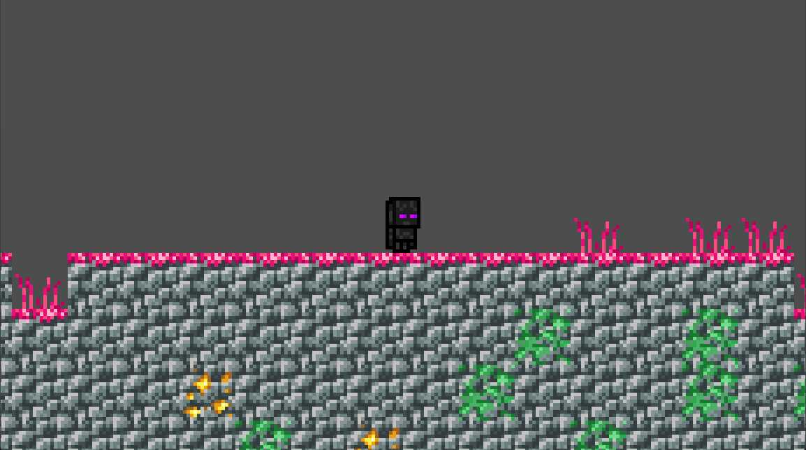

# GDSnippets
Just some useful Godot snippets for things.
<br>
**Contents:**
- [Procedural Terrain](#Procedural-Terrain)
- [Health and Shield Gating](#Health-and-Shield-Gating)
- [Titanfall's Ability Recharge](#Titanfall's-Ability-Recharge)

<br>

## Procedural Terrain

Procedural Generation is all over the place. It mostly plays a role in creating level content in rogue-like and survival games. A simple Terraria-style 2D level generator can be done as follows: Create a ```Node2D``` scene to act as our chunk generator. For every tile add a ```StaticBody2D``` with a ```CollisionShape``` and ```Sprite2D``` as it's children, with each texture being assigned to the sprite. Add additional Sprite only textures for decorations, like grass and flowers. Then add a script to the scene:
<br>
```gdscript
extends Node2D
#Called when the node enters the scene tree for the first time.
func _ready():
	generate()

func generate(): #Generates the terrain
	var textures = [$ore, $moss]
	var plants = [$plant, $tulip, $flower]
	var noise = FastNoiseLite.new()
	noise.seed = randf_range(-1000, 1000)*randf()

	for x in range(0, get_window().size.x+16, 16): #This code gnerates a noisey line of grass blocks at a determined hight.
		var k = round(noise.get_noise_1d(x)*3)*16 + 1080/1.5
		var grass_block = $grass.duplicate()
		grass_block.global_position = Vector2(x,k)
		add_child(grass_block)

		var spawn = randf() #This is used to roll a random number.
		if spawn < 0.15: #Decorations are also spawned in at random in this pass.
			var plant = plants.pick_random().duplicate()
			plant.global_position = Vector2(x,k-16)
			add_child(plant)
		elif spawn > 0.75:
			var plant = $plant.duplicate()
			plant.global_position = Vector2(x,k-16)
			add_child(plant)

		for y in range(k+16, 1080, 16): #Then every space below the grass is filled in with stone.
			var i = randf() #this is used to roll a random number.
			if i > 0.25:
				var block = $stone.duplicate()
				block.global_position = Vector2(x,y)
				add_child(block)
			else:
				var block = textures.pick_random().duplicate()
				block.global_position = Vector2(x,y)
				add_child(block)
```
I use ```FastNoiseLite``` to generate one-dimensional noise with a randomly picked seed value. The code is set up to snap the placed blocks to a 16px grid. In my code, I use arrays to randomly select decorations and special blocks. The end results looks like this:
<br>


In the above code I assigned variables random floats whenever I needed to roll a dice. But a much cleaner and more versitile solution would be to create a function that assignes a global variable:
<br>
```gdscript
var coin = 0 #Place at top of code.

func coinFlip():
	coin = randf() #randf() will generate a float value between 0 and 1.

coinFlip() #Called wherever needed.
```

The main disadvantage to this, is that it can sometimes break things when multiple functions are using it. But for our terrain generator that only needs to run once, it works just fine.
<br>

## Health and Shield Gating
Health Gating is a QoL feature in some games that prevents a player from being killed too quickly. It might not be an option for every games, especially in multiplayer shooters where Snipers and Shotguns are in play. But it can be a good accessability in other genres. Implementing such a system is as simple as containing our damage function in an if-statement that checks if the health is above our threshold, and if so, capping the damage to a set value.
<br>

```gdscript
var Health = 100 #Global variable

func health(damage: float):
	if damage >= Health and Health == 100:
		Health = 20
	else:
		Health -= damage
```
In this scenario, the function checks if the incoming damage is going to be more than the player's available health. If the player's health is full, the damage is capped to only being able to deal 80 damage.

In some games, such as Warframe, you may have both a health and shield bar. This can be gated to prevent the player from taking damage while they still have shield.
<br>

```gdscript
var Health = 100 #Global variables
var Shield = 100

func health(damage: float):
	if damage >= Shield and Shield > 0:
		Shield = 0
	elif damage <= Shield:
		Shield -= damage
  else:
    Health -= damage
```
<br>

## Titanfall's Ability Recharge
This is my implementation of the UI for recharging abilities, as seen in Titanfall 2. To set this up, I set up our ui element for the ability icon and placed a translucent ```ProgressBar``` sized and aligned behind it. The functions below are set up to allow a grenade to be thrown twice, and are placed in our setup code and called in the ```physics_process```. The first function simply decreases the progress bar by 50% if the ability action is pressed, while the second function constinuously refills it when it is below 100%.
<br>

```gdscript
func grenade():
	if Input.is_action_just_pressed("grenade_throw"):
		if grenade_recharge.value >= 50:
			grenade_recharge.value -= 50
      # additional code for grande or other ability

func recharge():
	if grenade_recharge.value < 100:
		grenade_recharge.value += 0.2 #controls the recharge speed
```
Be sure to set the progress bar's ```Fill Mode``` to "Bottom to Top" The resulting effect is this:
<br>

